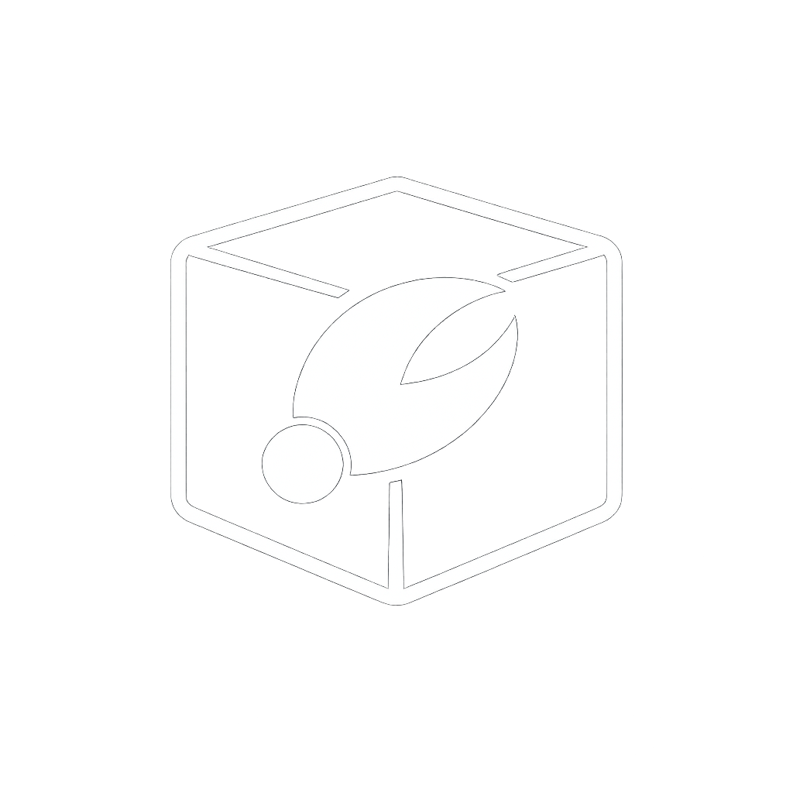

<p align="center">
  
</p>

# ClawLess

**A ClawContainer for AI Agents**

[](LICENSE)
[](CONTRIBUTING.md)
[](https://github.com/open-gitagent/clawless)

Browser-based AI agent runtime powered by WebContainers. Run, observe, and control AI agents entirely in the browser — no backend required.

---

## Key Features

- **WebContainer-powered sandboxed runtime (WASM)** — full OS-level isolation in the browser
- **Monaco Editor with multi-file tabs** — rich editing experience out of the box
- **xterm.js terminal with full PTY support** — real terminal sessions, not a toy console
- **GitHub integration** — clone and push repositories via the GitHub API
- **YAML-based policy engine with glob patterns** — declarative guardrails for agent behavior
- **Complete audit logging** — process, file, network, and git events captured end-to-end
- **Plugin system with lifecycle hooks** — extend and customize every stage of execution
- **Template system for agent configurations** — bootstrap agents from reusable presets
- **Network interception** — intercepts both browser `fetch` and Node.js `http` calls
- **Multi-provider AI support** — Anthropic, OpenAI, and Google out of the box

## Quick Start

```bash
git clone https://github.com/open-gitagent/clawless.git
cd clawless
npm install
npm run dev
```

## SDK Usage

```typescript
import { ClawContainer } from 'clawless';

const cc = new ClawContainer('#app', {
  template: 'gitclaw',
  env: { ANTHROPIC_API_KEY: 'sk-...' }
});

await cc.start();
cc.on('ready', () => console.log('Container ready!'));
```

## Architecture

| Component | Role |
|---|---|
| **ClawContainer** | SDK facade — the single entry point for consumers |
| **ContainerManager** | WebContainer orchestration and lifecycle |
| **PolicyEngine** | YAML-based guardrails enforcing file, process, and network rules |
| **AuditLog** | Complete event trail for every action inside the container |
| **GitService** | GitHub API integration (clone, commit, push) |
| **PluginManager** | Lifecycle hooks for extending container behavior |
| **UIManager** | Monaco Editor, xterm.js terminal, and tab management |

## Tech Stack

- **Vite + TypeScript** — fast builds, type-safe codebase
- **WebContainer API** — browser-native OS environment
- **xterm.js** — full-featured terminal emulator
- **Monaco Editor** — the editor behind VS Code

## Configuration

ClawLess is configured through environment variables passed to the `ClawContainer` constructor:

| Variable | Purpose |
|---|---|
| `ANTHROPIC_API_KEY` | Anthropic API key |
| `OPENAI_API_KEY` | OpenAI API key |
| `GOOGLE_AI_API_KEY` | Google AI API key |
| `CLAWLESS_MODEL` | Model selection (e.g. `claude-sonnet-4-20250514`, `gpt-4o`) |

All runtime state is persisted to `localStorage` under the `clawchef_` prefix, so sessions survive page reloads.

## Links

[Documentation](DOCS.md) | [Contributing](CONTRIBUTING.md) | [Code of Conduct](CODE_OF_CONDUCT.md) | [License](LICENSE)

---

Built with care by [Shreyas Kapale](https://github.com/shreyaskapale) / [Lyzr](https://lyzr.ai)
